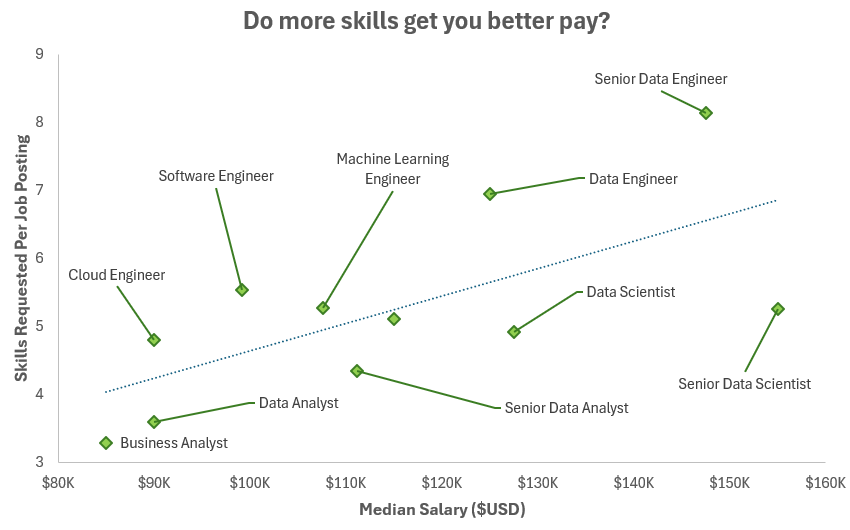
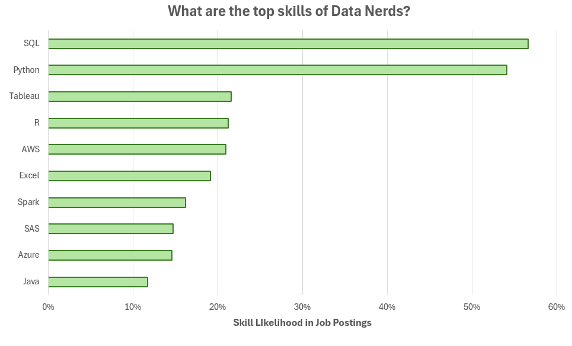
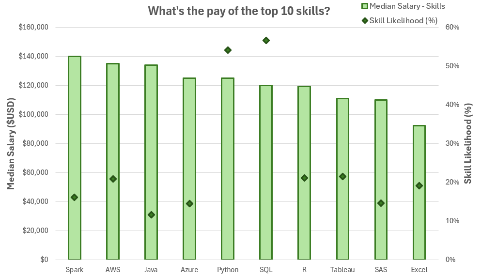

# 📊 Excel Data Analytics Projects

Welcome to my projects, which showcase my knowledge and skills in using Excel as a data analysis tool!

Special thanks to [Luke Barousse](https://github.com/lukebarousse) and [Kelly Adams](https://github.com/kellyjadams) for creating the [Excel Data Analytics Course](https://youtu.be/pCJ15nGFgVg?si=eaVSlBZP-crDsYqO), which helps aspiring data analysts build a strong foundation with this powerful tool.

The data used for both projects is sourced from materials provided by the course creators. The dataset includes detailed information on job titles, salaries, locations, and essential skills, based on real-world job postings from 2023.

# Data Nerds Salary Dashboard

This [Data Nerds Salary Dashboard](/1_Salary_Dashboard) was designed to help job seekers explore salary trends for their desired roles, ensuring they are fairly compensated.

# Data Nerds Skill Analysis

This [Data Nerds Skill Analysis](/2_Skill_Salary_Analysis) highlights the key skills required for various roles in the data science industry. It offers insights into the skills employers prioritize for specific positions and illustrates how proficiency in certain areas correlates with higher-paying roles and salaries.

