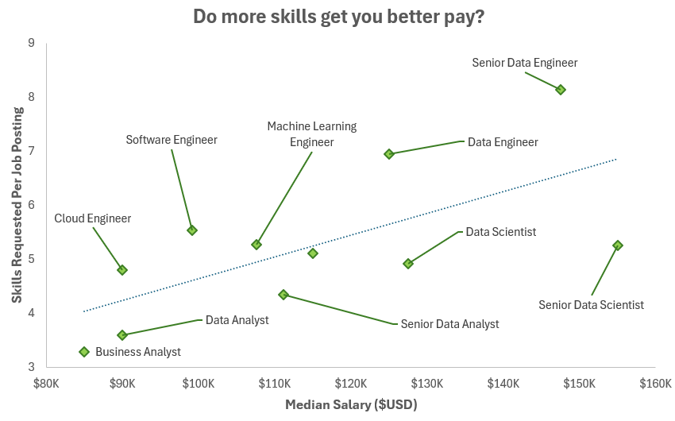
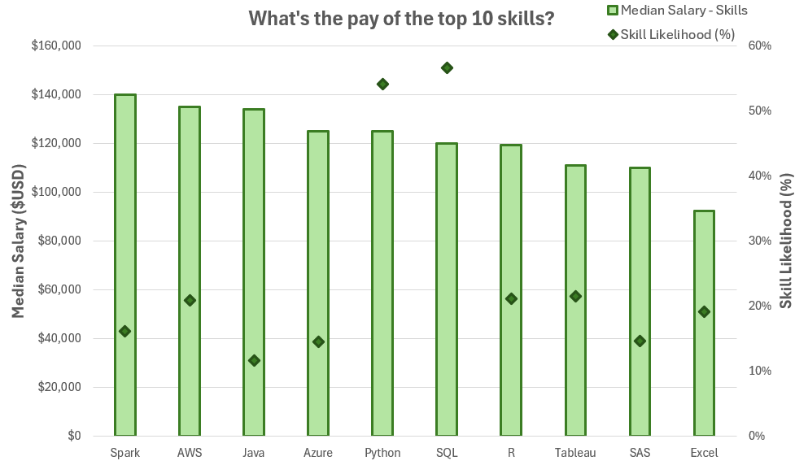

# 📊 Excel Data Analytics Projects

Welcome to my projects, which showcase my knowledge and skills in using **Excel** as a data analysis tool!

Special thanks to [Luke Barousse](https://github.com/lukebarousse) and [Kelly Adams](https://github.com/kellyjadams) for creating the [Excel Data Analytics Course](https://youtu.be/pCJ15nGFgVg?si=eaVSlBZP-crDsYqO), which helps aspiring data analysts build a strong foundation with this versatile tool.

The [data](/0_Resources/data_jobs_salary_all.xlsx) used for both projects is sourced from materials provided by the course creators. The dataset includes detailed information on job titles, salaries, locations, and essential skills, based on real-world job postings from 2023. 

These projects are excellent examples of how **Excel** can be used to interpret and visualize complex data effectively 💪

# Data Nerds Salary Dashboard

🎯 The [Data Nerds Salary Dashboard](/1_Data_Nerds_Salary_Dashboard) helps job seekers explore salary trends across various data-related job titles, providing essential insights into expected salaries for their desired roles. The tool highlights salary differences based on position, country, and job schedule type, enabling users to make well-informed career decisions.

# Data Nerds Skill Analysis

🎯 This [Data Nerds Skill Analysis](/2_Data_Nerds_Skill_Analysis) highlights the key skills required for various roles in the data science industry. It offers insights into the top skills employers prioritize for specific positions and illustrates how proficiency in certain areas correlates with higher-paying roles and salaries.

